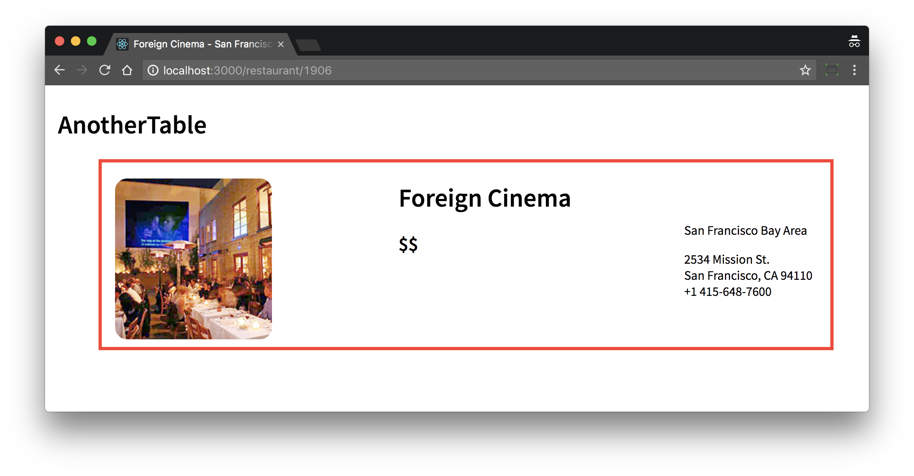

# another-table

another-table

## Restaurant profile page

```bash
npm install
npm run start
```

Go to http://localhost:3000/restaurant

### Tasks

- [X] Fix url `/restaurant` --> `/restaurant/:id` (id = restaurant id, e.g. 1906)

- [X] Fix page head `title` tag (e.g. Perry's Union Street - San Francisco | AnotherTable)

- [ ] Use the available data to create a restaurant profile header

- [X] Use `price` to show `$` symbol(s)

- [ ] Format phone number (e.g. `4153918311` --> `+1 415-648-7600`)

- [X] Add Node.js watcher (if you like)

- [ ] Add LiveReload (if you like)

- [X] Add ESLint (if you like)

- [ ] Add SASS (if you like)

#### Example


